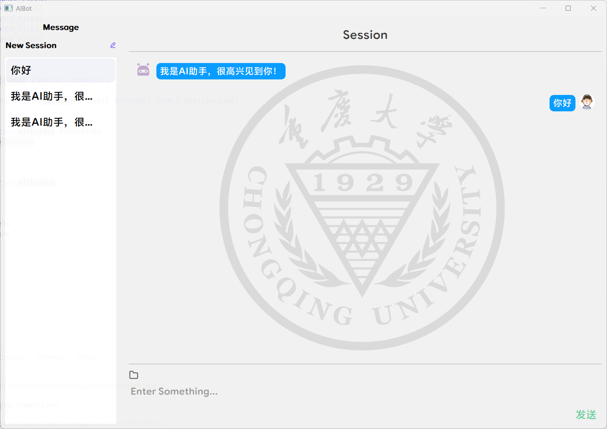

# AIChatBot
本工程是一个基于 **Qt5** 开发的图形界面程序，用于展示 AI 聊天界面。它包含界面绘制、消息渲染以及基本用户交互，适用于连接后端聊天模型或用于前端界面测试。

1 目录结构说明
------------
- **include/**  
  
  存放所有头文件，包含以下模块：
  
  - ChatPage：聊天页面逻辑相关
  - Component：通用 UI 组件
  - StyledItemDelegate：样式代理、列表样式控制等
  
- **src/**  
  
  各模块对应的 C++ 源文件。
  
- **Resource/**  
  
  项目所用图标、图片等资源文件（如头像、按钮图标等）。
  
- **test/**  
  
  测试模块，使用 Python 编写的简单聊天机器人脚本，用于模拟 AI 后端向前端发送消息。
  
- **build/**  
  
  编译输出目录（初次运行后生成），可在此目录中生成并执行可执行程序。

2 环境依赖与安装
---------------
请在 Ubuntu 或其他基于 Debian 的 Linux 系统中运行以下命令完成 Qt5 和构建环境的安装。

1. 安装 C/C++ 编译工具：

```bash
sudo apt-get update
sudo apt-get install build-essential
```

2. 安装 Qt5 开发工具：

```bash
sudo apt-get install qtbase5-gles-dev qtchooser qt5-qmake qtbase5-dev-tools
```

3. 检查 Qt 安装版本：

```bash
qmake -v
示例输出：
QMake version 3.1
Using Qt version 5.15.13 in /usr/lib/riscv64-linux-gnu
```

4. 安装 Qt5 Wayland 插件（如果在 Wayland 环境下运行）：

```bash
sudo apt-get install qtwayland5
```

5. 设置 Qt5 后端显示环境变量（仅当你使用 wayland）：

```bash
export QT_QPA_PLATFORM=wayland
```

## 3 项目编译方法

1. 在项目根目录下创建构建目录：

```bash
mkdir build
cd build
```

2. 使用 `cmake` 配置：

```bash
cmake ..
```

3. 构建项目：

```bash
cmake --build .
```

4. 编译完成后，将在 `build/` 目录中生成可执行文件 `AIChatBot`，运行程序：

```bash
./AIChatBot
```

## 4 运行截图

>   

联系方式
--------
如有任何问题或建议，欢迎提交 issue 或联系开发者。

